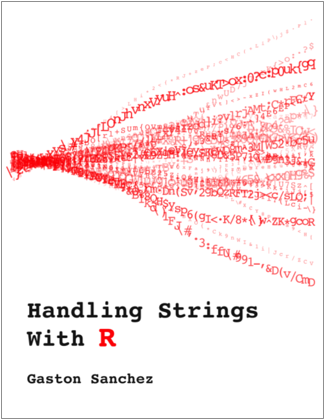

# Handling Strings with R

This repository contains the text and code of the book __[Handling Strings with R](https://leanpub.com/r4strings)__.

## Author

[Gaston Sanchez](https://www.gastonsanchez.com)

## License

 This work is licensed under a <a rel="license" href="http://creativecommons.org/licenses/by-nc-sa/4.0/">Creative Commons Attribution-NonCommercial-ShareAlike 4.0 International License</a>.

See [LICENSE](./LICENSE) for a human readable form, or check the [legal code](https://creativecommons.org/licenses/by-nc-sa/4.0/legalcode)
