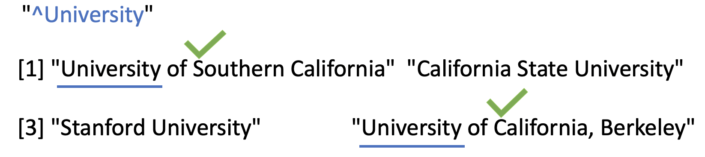
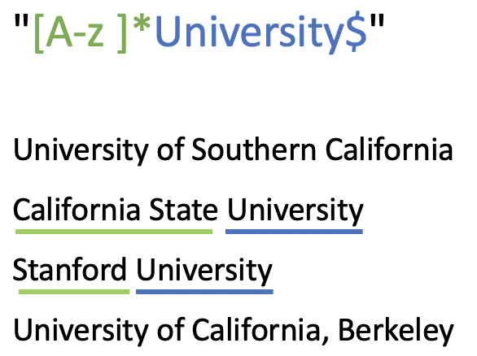
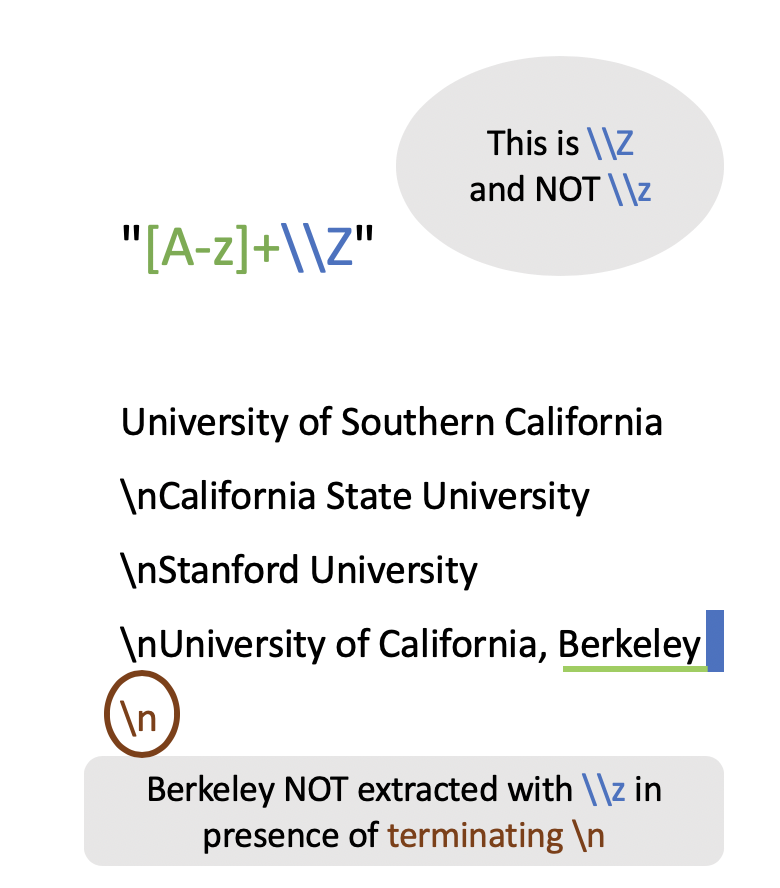

# Anchors {#anchors}

#### by Chitra Venkatesh {-}

Anchors are metacharacters that help us assert the position, say, the beginning 
or end of the string.

| Anchor   | Description | Example | 
|:---------|:------------|:--------|
| `^` | Matches a line starting with the substring.| `^New` |
| `\\$` | Matches a line ending with the substring.| `y$` |
| `^ \\$` | Matches a line that starts and ends with substring, i.e., exact match.| `^Hi There$` |
| `\\A` | Matches input starting with the substring.| `\\AHello` |
| `\\Z` and `\\z` | Matches input ending with the substring. `\\Z` also matches if there is a newline after the substring.| `End\\Z` |

<br>

As an example, we will consider a simple character vector `university` 
containing names of some universities.

```{r}
university <- c(
  "University of Southern California", 
  "California State University", 
  "Stanford University", 
  "University of California, Berkeley")

university
```


Let's try to detect university names that begin with `University`. To do this, 
we use `str_detect()` from the `"stringr"` package. Likewise, we use `regex()`
inside `str_detect()` to let R know that we are going to pass a regex pattern. 
This is also the default setting so you may choose to skip it.

What about the regex pattern? Because we are interested in matching those
strings that _begin_ with the word `University`, we are going to use the `^`
metacharacter as the __starting anchor__, followed by the string we want to 
match: `^University`. Here's how:

```{r}
university <- c(
  "University of Southern California", 
  "California State University", 
  "Stanford University", 
  "University of California, Berkeley")

str_detect(university, regex("^University"))
```

As you can tell from the following illustration, only the first and fourth 
elements in `university` are being matched.

```{r echo=FALSE, out.width='80%'}

```

Similarly we could detect university names that end with `University`. To do 
this, we have to use the metacharacter `$` to indicate the _ending anchor_,
forming the pattern: `University$`.

```{r}
str_detect(university, regex("University$"))
```

In previous example, we detected universities with names that end with 
`University`. Let's try to extract them now. To make things more interesting, 
we have modified the content of vector `university`, now consisting of multiple 
lines (notice the newline characters `\n`). 

```{r}
university <- c(
  "University of Southern California
  \nCalifornia State University
  \nStanford University
  \nUniversity of California, Berkeley\n")

cat(university)
```

We use `str_extract_all()` instead of `str_extract()` to extract all occurances 
of the pattern. Also note the `multiline` argument is used in `regex()` to tell 
R to expect input consisting of multiple lines.

```{r}
university <- c(
  "University of Southern California
  \nCalifornia State University
  \nStanford University
  \nUniversity of California, Berkeley\n")

str_extract_all(university, regex("[A-z ]*University$", multiline = TRUE))
```

```{r echo=FALSE, out.width='40%'}

```

Lastly, lets try to extract the last word of our input from previous example. 

Using `str_extract()` or `str_extract_all()` does not matter anymore. While we 
get a single output for both, the former returns a list and the latter 
returns a list of lists.

```{r}
str_extract(university, regex("[A-z]+\\Z", multiline = TRUE))
```

Notice that `\\Z` works even in presence of a terminating newline `\n`. 
However, when we use `\\z`, this won't work until we remove the terminating 
`\n`.

```{r echo=FALSE, out.width='50%'}

```

```{r}
str_extract(university, regex("[A-z ]+\\z", multiline = TRUE))
```

With the newline terminator removed from the input, `\\z` works just as well.

```{r}
university = c("University of Southern California
               \nCalifornia State University
               \nStanford University
               \nUniversity of California, Berkeley")

str_extract(university, regex("[A-z ]+\\Z", multiline = TRUE))

str_extract(university, regex("[A-z ]+\\z", multiline = TRUE))
```


