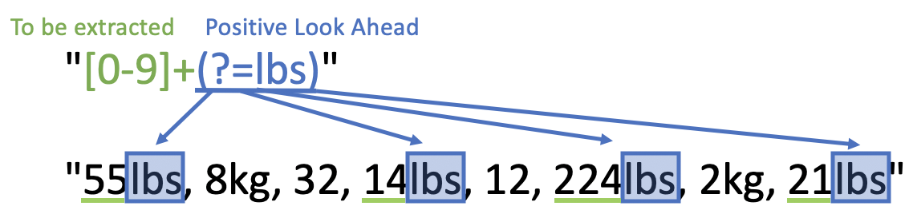
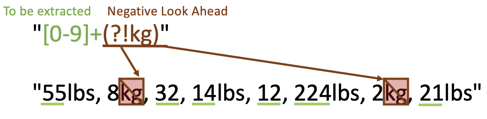
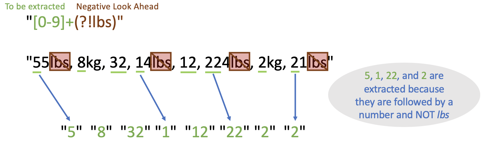
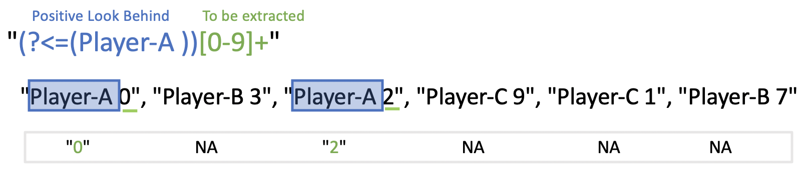

# Boundaries and Look Arounds {#boundaries}

#### by Chitra Venkatesh {-}

Boundaries are metacharacters too and match based on what preceeds or follows current position. Let's understand this through some examples after reviewing common boundaries.

| Boundary | Description | Example    |
|:---------|:------------|:-----------|
| `\\b`    | Matches a word boundary, i.e., when a side is not `[A-z0-9_]` | `\\bHi \\bHi\\b` |
| `\\B`    | Matches when not a word boundary, i.e., when a side is `[A-z0-9_]` | `\\BHi` |

In the following example, we would try these cases:

- Case 1: Extract words that exactly match with `hi`

- Case 2: Extract words that contain `hi` in between characters

- Case 3: Extract words that start with `hi`

```{r}
some_text <- c("Hi there, its high time we learn shiny apps")
```

**Case 1:** Extract words that exactly match with `hi`.
Note the use of `ignore_case` argument to regex()

```{r}
str_extract_all(some_text, regex("\\bhi\\b", ignore_case = TRUE))
```


**Case 2:** Extract words that contain `hi` in between characters

- We include `[A-z]*` on either side of `\\Bhi\\B` to match the entire word,
otherwise the pattern `\\Bhi\\B` will only match `hi` from `shiny`. 

- We used `[A-z]*` instead of `[A-z]+` to specifically showcase that no other 
`hi` got matched as `*` denotes 0 or any.

```{r}
str_extract_all(some_text, regex("[A-z]*\\Bhi\\B[A-z]*", ignore_case = TRUE))
```

**Case 3:** Extract words that start with `hi`

Note that `shiny` is not matched since it starts with `s` and not `hi`.

```{r}
str_extract_all(some_text, regex("\\bhi[A-z]*", ignore_case = TRUE))
```


## Look Arounds

As the name suggests, it helps look around the string. `Look Arounds` indicate
positions just like anchors, `$`, `^`, that we learnt in previous section.

There are four types of look arounds.

|Look Around| Notation| Description|
|-------|-------|------------|
|Positive Look Ahead|`A(?=pattern)`	| Check if pattern follows A|
|Negative Look Ahead|`A(?!pattern)`	| Check if pattern does not follow A|
|Positive Look Behind|`(?<=pattern)A` | Check if pattern precedes A|
|Negative Look Behind|`(?<!pattern)A` | Check if pattern does not preceed A|

In the table, `A` refers to a character set/group that we are trying to extract.


### Look Aheads

Let's look at some examples for Look Aheads.

In the variable `weights_item`, we have weights of items and we would like to 
retrieve the weights without the unit of measurement.

```{r}
weights_item <- c("55lbs", "32","14lbs","12","224lbs")

str_extract(weights_item, regex("[0-9]+"))
```

Let's change the format of `weights_item` and check how the output looks like. 
We will use `str_extract_all()` instead of `str_extract()` to extract all
occurances of weights in a single string.

```{r}
weights_item <- "55lbs, 32, 14lbs, 12, 224lbs"

str_extract_all(weights_item, regex("[0-9]+"))
```

Let's change our input to contain weights that are in kilograms. 

```{r}
weights_item <- "55lbs, 8kg, 32, 14lbs, 12, 224lbs, 2kg, 21lbs"

str_extract_all(weights_item, regex("[0-9]+"))
```

In case we want to retrieve only those weights with unit of measurement lbs, we
could use a _positive look ahead_. In the syntax `A(?=pattern)`, the pattern we
look for would be `lbs`. Any number that is followed by `lbs` will be extracted
hence `A` is `[0-9]+`.

Don't forget that `(?=lbs)` does not extract `lbs`, it is used to assert 
position only!

```{r echo=FALSE, out.width='75%'}

```


```{r}
weights_item <- "55lbs, 8kg, 32, 14lbs, 12, 224lbs, 2kg, 21lbs"

str_extract_all(weights_item, regex("[0-9]+(?=lbs)"))
```

In case we want to extract all weights that don't have `kg` as the unit of
measurement, we could use _negative look ahead_. In the syntax `A(?!pattern)`, 
the pattern here is `kg` and `A` should be character class `[0-9]` with
quantifier `+` (one or many).

```{r echo=FALSE, out.width='75%'}

```


```{r}
weights_item <- "55lbs, 8kg, 32, 14lbs, 12, 224lbs, 2kg, 21lbs"

str_extract_all(weights_item, regex("[0-9]+(?!kg)"))
```

Similarly, using _negative look ahead_ to extract all weights that don't have
`lbs` as the unit of measurement should work too, but in the code snippet below,
we get an incorrect output. Can you guess why?

```{r}
weights_item <- "55lbs, 8kg, 32, 14lbs, 12, 224lbs, 2kg, 21lbs"

str_extract_all(weights_item, regex("[0-9]+(?!lbs)"))
```

This is incorrect since we extract the 5 from 55lbs, 1 from 14lbs, 22 from
224lbs and 2 from 21lbs additional to our actual answer.

```{r echo=FALSE, out.width='90%'}

```


We could overcome this by specifically mentioning that the number (weight) **cannot** be followed by:

- the pattern `lbs`

- some number (i.e, from 21lbs, we should not extract 2)

To do this, we could use `alternation`, denoted as pipe `|`, which is similar 
to `OR`.

The pattern in `A(?!pattern)` is now `lbs` or `[0-9]+`, which we can represent
as `(lbs|[0-9]+)`. Note that our pattern in enclosed within paranthesis.

```{r}
weights_item <- "55lbs, 8kg, 32, 14lbs, 12, 224lbs, 2kg, 21lbs"

str_extract_all(weights_item, regex("[0-9]+(?!(lbs|[0-9]+))"))
```

The illustration above is typical of regular expressions. As the test cases 
become complex, one has to tweek the expression to include all the corner cases.


### Look Behinds

As the name suggests, we look behind the current position for presence or
absence of a pattern. This works the same way as look ahead, except that we 
look for the preceding characters.

Let us look at some examples.

Consider a variable `runs` that has data of some baseball players from a team 
over two games. We will use a _positive look-behind_ to extract scores of 
`Player-A`. In the syntax `(?<=pattern)P`, pattern is `(Player-A )` and `P` is
the score we want to extract, i.e., `[0-9]+`.

```{r}
runs <- c(
  "Player-A 0", 
  "Player-B 3", 
  "Player-A 2", 
  "Player-C 9", 
  "Player-C 1", 
  "Player-B 7")

str_extract(runs, regex("(?<=(Player-A ))[0-9]+"))
```

```{r echo=FALSE, out.width='95%'}

```


Similarly, we can use a _negative look-behind_ to extract scores of players who 
are not `Player-A`. In the syntax `(?<!pattern)P`, `P` is `[0-9]+` and the
pattern is `(Player-A )`.

```{r}
runs <- c(
  "Player-A 0", 
  "Player-B 3", 
  "Player-A 2", 
  "Player-C 9", 
  "Player-C 1", 
  "Player-B 7")

str_extract(runs, regex("(?<!(Player-A ))[0-9]+"))
```
