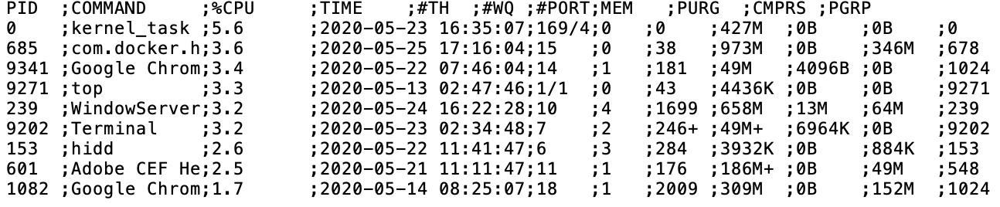

# Logical Operations in regex {#logical}

#### by Chitra Venkatesh {-}


## Logical Operation in Regex

We don't have earmarked Logical Operators in Regex, however, a few syntaxes 
could replicate these.

We saw in one of the examples for look aheads that logical OR is expressed 
using the pipe symbol | in regex. This is also known as 'Alternation` operation.

There is no `AND` in regex, but it can be synthesized using look arounds. For 
`NOT` operation, the `^` symbol works in character classes but cannot be used
for groups as explained later.

| Operation | Syntax          | Example              |
|-----------|-----------------|----------------------|
| OR        | Pipe symbol `\` | \|pattern1\|pattern2 |
| NOT       | Cap symbol `^`  | `[^aeiou]`           |
| AND       | Synthetic `AND` | `(?=P1)(?=P2)`       |


### Logical OR

Consider the variable `student_names` from previous example. If we want to
display names that are of length 4 OR of length 5, we use the pipe symbol.

```{r}
student_names <- c("Lee", "Carol", "Sameer", "Luca", "Rajan", "George Jr.")

str_extract(student_names, regex("^([A-z]{4}|[A-z]{5})$"))
```

Note that for the above example, we could use quantifier `{4,5}` and still
obtain the same result.


### Logical NOT

Using the NOT `^`, we could extract names that don't contain `e` or `u`. 

```{r}
str_extract(student_names, regex("^[^eu]+$"))
```

Note that `^` operation cannot be used for groups. This is because it is unclear
in such cases if we are using `^` as a NOT operator or an anchor. In such cases
we could use a negative look around. Let's say, we have a group `(ee)` and we
want to extract names without the group `(ee)`. 

```{r}
str_extract(student_names, regex("^(?!.*ee).*$"))
```


### Logical AND

Consider a case where we want to extract names with length greater than 4 and
containing letter `o`. We have two conditions and we need to `AND` them.

- Condition 1: Length > 4, the pattern is `(?=.{5,})`

- Condition 2: Contains `o`, the pattern is `(?=.*o)`

The two conditions can be used together.

```{r}
student_names <- c("Lee", "Carol", "Sameer", "Luca", "Rajan", "George Jr.")

str_extract(student_names, regex("(?=.{5,})(?=.*o).*"))
```


## Greedy vs Lazy Match

As you might have noted in previous cases, regex tend to return `greedy`
results., i.e., the longest match possible for a given expression. Let's 
explore this idea further and see if we can force it to be `lazy`.

In our previous example, quantifier `{5,7}` returned a `greedy` match, i.e., 
the result was of the maximum length possible. 

```{r}
student_names <- c("Lee", "Carol", "Sameer", "Luca", "Rajan", "George Jr.")

str_extract(student_names, regex("^[A-z]{5,7}$"))
```

Let us remove the anchors to see whether it is indeed `greedy`. By removing the
anchors, it prints the first 5-7 characters of all names, provided name length 
is at the minimum 5.

```{r}
str_extract(student_names, regex("[A-z]{5,7}"))
```

We could make it `lazy` by adding a `?` after the quantifier. For names `Sameer` 
and `George`, it prints only the first 5 characters.

```{r}
str_extract(student_names, regex("[A-z]{5,7}?"))
```

Similarly, we could make other quantifiers `lazy`.

| Original Quantifier (Greedy) | Lazy Version |
|----------|-----------|
| `P*`     | `P*?`     |
| `P+`     | `P+?`     |
| `P?`     | `P??`     |
| `P{n}`   | `P{n}?`   |
| `P{m,}`  | `P{m,}?`  |
| `P{m,n}` | `P{m,n}?` |


## Common Applications

#### Log Parsing {-}

Consider a log from a server that runs several jobs. Let's perform a couple of
operations on this log.

```{r echo=FALSE, out.width='55%'}

```


```{r}
log_data <- read.csv('log.txt', header = TRUE, sep =";")

log_data$TIME = as.character(log_data$TIME)
```

From the time column, lets try to separate time and date.

For example, from `2020-05-23 16:35:07`, we should separate `2020-05-23` and
`16:35:07`. One way to split them is using look around. Beyond regex, one could 
also use `str_split()` in R.

```{r}
str_extract(log_data$TIME, regex(".*(?= )"))
```

```{r}
str_extract(log_data$TIME, regex("(?<= ).*"))
```

Let us try to extract the hours and minutes separately from the time. We could 
use a `positive look ahead` with pattern `:` for hours and two look arounds, 
i.e. one look ahead, one look behind to look for `\\\\d+` flanked by semicolon 
on both sides. 


```{r}
# exact hours
str_extract(log_data$TIME, regex("\\d+(?=:)"))
```

```{r}
# exact minutes
str_extract(log_data$TIME, regex("(?<=:)\\d+(?=:)"))
```

